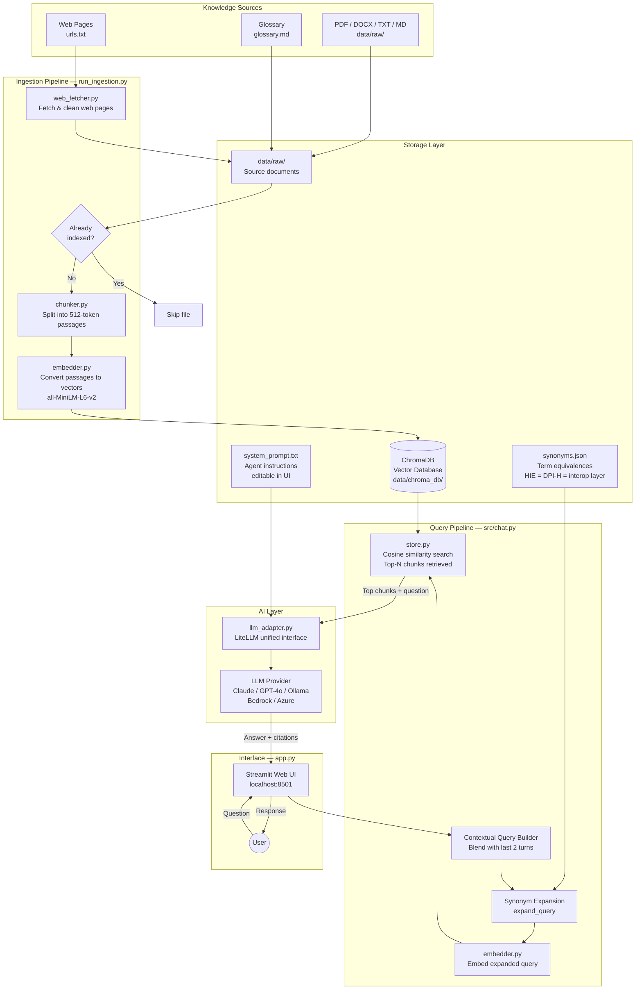
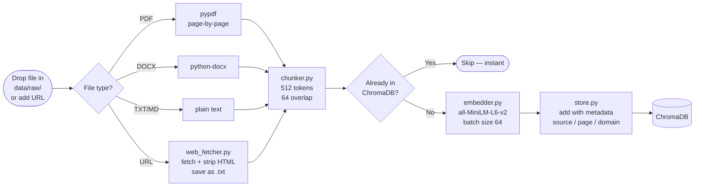
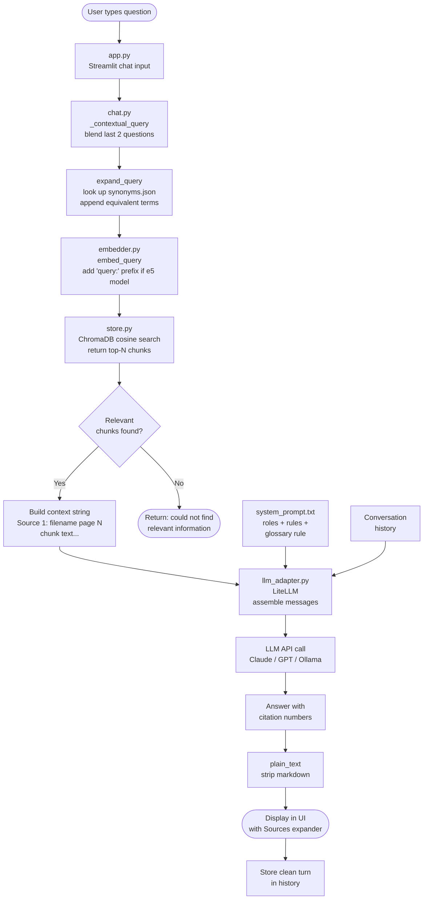
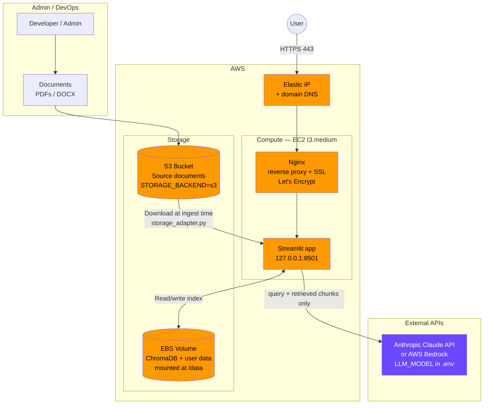

# SIAgent — Standards & Interoperability RAG Assistant

A conversational AI assistant that answers questions grounded in your own document library. Built for digital health teams who need reliable, citation-backed guidance on standards, interoperability frameworks, and implementation practice — without hallucination.

---

## What it does

You upload documents (PDFs, Word files, web pages). The agent reads and indexes them. When a user asks a question, it searches the document library for relevant passages, passes them to an AI language model, and returns an answer with citations pointing back to the source material.

It does **not** answer from general internet knowledge alone. Every response is grounded in what is in your knowledge base. If the answer is not there, it says so.

**Key capabilities:**

- Ask natural language questions across hundreds of documents simultaneously
- Receive answers with numbered citations linking back to specific source files and page numbers
- Ingest PDFs, Word documents, plain text, markdown, and web page URLs
- Filter and tune retrieval (how many source chunks to consider per question)
- Edit the AI agent's instructions directly in the browser — no code required
- Supports multilingual documents (English, French, Portuguese, Swahili, and 100+ others)

---

## Who it is for

Teams and organisations that maintain a library of policy documents, standards guides, technical handbooks, or implementation resources and want to make that knowledge quickly searchable and conversational. Typical use cases include:

- Digital health standards and interoperability teams
- Country digital health programme offices
- International agencies publishing implementation guidance
- Anyone building a domain-specific knowledge assistant on their own documents

---

## How it works (plain English)

```
Your documents
     ↓
Chunked into passages → Converted to vectors → Stored in a local database
                                                        ↓
User asks a question → Question converted to vector → Top matching passages retrieved
                                                        ↓
                                          Passages + question sent to AI model
                                                        ↓
                                          Answer returned with source citations
```

This pattern is called **Retrieval-Augmented Generation (RAG)**. The AI model never invents sources — it can only cite what was retrieved from your documents.

---

## Architecture

### Full system overview



---

### Ingestion pipeline detail



---

### Query and RAG flow detail



---

### AWS production deployment



> **Note on data flow:** your source documents are never sent to the LLM. Only the user's question and the matching text passages (retrieved from ChromaDB) are included in the API call. Source documents stay in S3 / local storage at all times.
>
> For full step-by-step deployment instructions, see [DEPLOYMENT.md](DEPLOYMENT.md).

---

## Technology stack

| Component | Default choice | Can be swapped for |
|---|---|---|
| AI language model | Anthropic Claude | OpenAI, Azure OpenAI, Ollama (local/free) |
| Embeddings (search) | sentence-transformers (runs locally, free) | OpenAI, Cohere |
| Vector database | ChromaDB (local, no server needed) | Qdrant, Weaviate, pgvector |
| Document storage | Local folder or AWS S3 | Azure Blob, GCP, any filesystem |
| Web interface | Streamlit | Any — the chat core is independent |

The local defaults require no cloud accounts and no API fees beyond the AI model.

---

## Local setup (for testing)

**Prerequisites:** Python 3.10 or higher, pip

```cmd
# 1. Clone or copy the project folder
cd SIAgent

# 2. Install dependencies
pip install -r requirements.txt

# 3. Set your API key
copy .env.example .env
notepad .env
# → Set ANTHROPIC_API_KEY to your key from console.anthropic.com

# 4. Add documents
#    Drop PDF, DOCX, TXT, or MD files into a subfolder of data\raw\
#    (e.g. data\raw\who_guidelines\, data\raw\research_papers\, etc.)
#    Add web page URLs (one per line) into:   data\urls.txt

# 5. Ingest documents into the knowledge base
python scripts/run_ingestion.py

# 6. Launch the assistant
streamlit run app.py
#    Opens in your browser at http://localhost:8501
```

Ingestion only needs to run again when you add new documents.

---

## Project structure

```
RAISI/
├── app.py                   # Main interface — login, chat, admin panel (Streamlit)
├── requirements.txt         # Python dependencies
├── .env.example             # Configuration template — copy to .env
├── DEPLOYMENT.md            # Full AWS EC2 deployment guide for DevOps
├── CHATBOT.md               # Product overview and knowledge base description
│
├── pages/
│   ├── 1_Suggest_Document.py  # User-facing document submission form
│   └── 2_KB_Review.py         # Admin/reviewer document review panel
│
├── src/
│   ├── chat.py              # RAG core: retrieve → call AI → return answer
│   ├── suggestions.py       # Generates alternative questions on "not found" responses
│   ├── ingestor.py          # Document loading and ingestion pipeline
│   ├── chunker.py           # Splits documents into searchable passages
│   ├── embedder.py          # Converts text to vectors for search
│   ├── store.py             # Vector database interface (ChromaDB)
│   ├── storage_adapter.py   # Switches between local storage and AWS S3
│   ├── rate_limiter.py      # Per-user daily question limit (AEST timezone reset)
│   ├── web_fetcher.py       # Fetches and indexes web pages from URLs
│   ├── kb_submissions.py    # Document submission and review workflow
│   ├── page_auth.py         # Page-level login and role enforcement helper
│   ├── auth.py              # User accounts, roles (admin/reviewer/user)
│   ├── feedback.py          # Thumbs up/down feedback logging
│   └── security_log.py      # Login and security event logging
│
├── scripts/
│   ├── run_ingestion.py     # Run this to add documents to the knowledge base
│   ├── run_eval.py          # Automated benchmark evaluation (Claude-as-judge)
│   └── test_search.py       # Run this to test search without the UI
│
└── data/
    ├── raw/                 # Knowledge base root — organised into subfolders
    │   ├── who_guidelines/       # WHO guidance documents
    │   ├── standards_docs/       # HL7, FHIR, IHE, SNOMED specs
    │   ├── research_papers/      # Academic and research literature
    │   ├── donor_guidelines/     # World Bank, ADB, USAID, donor guidance
    │   ├── case_studies/         # Case studies and pilots
    │   ├── country_profiles/     # Country-level digital health assessments
    │   ├── open_source_tools/    # OpenHIE, DHIS2, OpenMRS documentation
    │   ├── sscp/                 # SSCP priority sources (retrieved first)
    │   └── to_be_reviewed/       # Staging: user-submitted docs awaiting review
    ├── urls.txt             # Web URLs to fetch and index (one per line)
    ├── chroma_db/           # Vector database (auto-created on the server)
    ├── eval_benchmark.json  # Benchmark questions for automated evaluation
    ├── synonyms.json        # Term equivalences (HIE = DPI-H = interop layer)
    ├── glossary.md          # Domain glossary — indexed with the KB
    └── system_prompt.txt    # AI agent instructions (editable in the UI)
```

---

## Adding documents

**Local files:** place any `.pdf`, `.docx`, `.txt`, or `.md` file into `data/raw/` then run:

```cmd
python scripts/run_ingestion.py
```

**Web pages:** add URLs to `data/urls.txt` (one per line, `#` for comments) then run the same command. Pages are downloaded, cleaned, and stored as text files. Already-fetched pages are skipped on re-runs.

```
# data/urls.txt example
https://build.fhir.org/overview.html
https://www.who.int/publications/i/item/9789240020443
```

To re-fetch all URLs with updated content:

```cmd
python scripts/run_ingestion.py --refresh-urls
```

---

## Priority knowledge base (SSCP folder)

You can designate a subset of your documents as **priority sources** — content that will always be retrieved first and treated as the authoritative basis for answers, cross-validated against the general knowledge base.

This is designed for project-specific learnings, field experience, lessons learned, and country assessments that should take precedence over general guidance when both are relevant.

### How it works

```
data/raw/
├── sscp/                  ← priority knowledge base
│   ├── lessons-learned.pdf
│   ├── country-assessment-2024.docx
│   └── field-notes.md
└── [all other documents]  ← general knowledge base
```

1. Drop documents into `data/raw/sscp/`
2. Run ingestion — SSCP files are automatically detected and tagged
3. On every query, SSCP chunks are retrieved first (up to 2 of the top N results)
4. The LLM is instructed to treat SSCP sources as primary and cross-validate against general sources
5. If a general source contradicts an SSCP source on a practical matter, the SSCP perspective is preferred

### Rules applied to SSCP sources

- SSCP content is the **primary authoritative basis** — it reflects real implementation experience
- General KB sources **enrich and validate** the SSCP answer
- If a general source **contradicts** an SSCP source on a practical matter, the SSCP perspective is preferred with the difference noted
- If there is a **fundamental factual contradiction** on a published standard, both perspectives are presented

### Running ingestion with SSCP

```cmd
:: Standard run — picks up data/raw/sscp/ automatically
python scripts/run_ingestion.py

:: Force re-index everything including SSCP folder
python scripts/run_ingestion.py --force
```

The admin sidebar shows the SSCP chunk count separately so you can confirm documents are indexed.

### Adapting for your own project

The SSCP folder name and priority rules are configurable. To rename or add multiple priority collections, edit:
- `src/store.py` — `search_with_sscp_priority()` for retrieval logic
- `data/system_prompt.txt` — the SSCP SOURCES instruction block
- `src/chunker.py` — the `sscp` field on the `Chunk` dataclass

---

## Smart question suggestions

When the chatbot cannot find a relevant answer, it does not just return a dead end. It automatically generates 4 alternative questions based on what the knowledge base actually contains, and displays them as clickable buttons below the response. The user can click any suggestion to ask it immediately, or type their own follow-up in a free-text field.

### How it works

1. After every response, the app checks for the "not found" phrase in the output.
2. If detected, a second LLM call fires — it looks at the chunks that were retrieved for the original question (which are topically related but not specific enough) and generates 4 questions those chunks can actually answer.
3. The suggestions appear as buttons at the bottom of the response. They only show for the most recent unanswered message — old suggestions do not clutter the conversation history.
4. Clicking a suggestion submits it as the next question, passing through the same rate-limit and history logic as a typed prompt.

This is the only place where two LLM calls happen in one turn. It fires on roughly 17% of questions based on benchmark testing, and adds about 2–3 seconds of latency only on those failures.

### Implementation

- `src/suggestions.py` — suggestion generation logic
- `app.py` — `_render_suggestions()` for the UI, `is_not_found()` detection after streaming

---

## Customising the AI agent instructions

Open the app, expand **"Agent Instructions"** in the left sidebar, edit the text, and click **Save**. Changes apply immediately — no restart required. Instructions are stored in `data/system_prompt.txt` and loaded automatically on startup.

This is where you define the agent's persona, rules, tone, domain focus, and citation style.

---

## Configuration reference (`.env` file)

| Variable | Default | What it controls |
|---|---|---|
| `ANTHROPIC_API_KEY` | *(required)* | Your AI provider API key |
| `LLM_MODEL` | `anthropic/claude-sonnet-4-6` | Which model to use (LiteLLM format) |
| `EMBEDDING_MODEL` | `all-MiniLM-L6-v2` | Local embedding model (~90 MB, no API key) |
| `CHROMA_DB_PATH` | `./data/chroma_db` | Where the vector database is stored |
| `CHROMA_COLLECTION` | `digital_health_kb` | Collection name inside ChromaDB |
| `CHUNK_SIZE` | `512` | Tokens per passage chunk |
| `CHUNK_OVERLAP` | `64` | Overlap between consecutive chunks |
| `RAG_N_RESULTS` | `5` | Number of passages retrieved per question |
| `STORAGE_BACKEND` | `local` | `local` or `s3` (use `s3` on AWS) |
| `AWS_BUCKET_NAME` | *(S3 only)* | S3 bucket containing your documents |
| `AWS_PREFIX` | `documents/` | Folder prefix inside the bucket |
| `AWS_REGION` | `ap-southeast-2` | AWS region |
| `DAILY_QUESTION_LIMIT` | `50` | Max questions per user per day (0 = unlimited) |
| `RATE_LIMIT_TIMEZONE` | `Australia/Sydney` | Timezone for daily reset (any tz database name) |

---

## Deployment considerations

### Choosing an AI model provider

The default is Anthropic Claude. To use a different provider, update `src/chat.py` to call your preferred API. Key considerations:

- **Data residency:** some organisations require data to remain in a specific country or cloud region. Check your provider's data processing agreements before sending document content to an external API.
- **Cost:** most providers charge per token (input + output). Monitor usage — a heavily used assistant with large documents can accumulate meaningful cost.
- **Rate limits:** if many users query simultaneously, you may hit provider rate limits. Consider queuing or caching for high-traffic deployments.
- **Local/offline option:** [Ollama](https://ollama.com) runs open-weight models (Llama, Mistral, etc.) entirely on your own hardware — no API key, no data leaving your network. Suitable for sensitive or air-gapped environments.

### Choosing a deployment platform

| Platform | Suitable for | Notes |
|---|---|---|
| Local machine | Development and testing | Single user only |
| AWS EC2 | Production (recommended) | See [DEPLOYMENT.md](DEPLOYMENT.md) for full guide |
| Azure / GCP | Production | Swap S3 adapter for Azure Blob / GCS |
| On-premises server | Air-gapped / sensitive environments | Use Ollama for the AI model to keep everything local |

### Storage in production

Set `STORAGE_BACKEND=s3` and point `AWS_BUCKET_NAME` at your document bucket. The application downloads documents from S3 at ingestion time. Use IAM roles rather than hardcoded credentials — do not store `AWS_ACCESS_KEY_ID` in the environment on shared infrastructure.

The vector database (ChromaDB) writes to a local folder. In a containerised deployment, mount this folder to persistent storage (EFS on AWS, an Azure file share, or a Docker volume) so the index survives container restarts.

### Security

- Store your API key in a secrets manager (AWS Secrets Manager, Azure Key Vault, HashiCorp Vault) rather than in a `.env` file on a server.
- The Streamlit interface has no built-in authentication. For internal tools, place it behind a VPN or identity-aware proxy. Do not expose it publicly without adding an authentication layer.
- The `data/system_prompt.txt` file controls agent behaviour. Restrict write access to trusted administrators in production.

### Scaling

ChromaDB is a single-node database suitable for up to a few million document chunks — sufficient for most organisational knowledge bases. If you grow beyond this, migrate to a dedicated vector database service (Qdrant, Weaviate, or pgvector on PostgreSQL). Only `src/store.py` needs changing.

---

## Troubleshooting

| Problem | Fix |
|---|---|
| `ModuleNotFoundError` | Run `pip install -r requirements.txt` first |
| `ANTHROPIC_API_KEY not set` | Check your `.env` file — make sure you copied from `.env.example` |
| `No documents found` | Put files in `data/raw/` before running ingestion |
| Slow first run | Normal — the embedding model (~500MB) downloads once on first use |
| ChromaDB duplicate ID error | Delete `data/chroma_db/` and re-run ingestion |
| URL fetch fails | Check the URL is publicly accessible; some sites block automated requests |

---

## Making it your own

This project is domain-agnostic. To adapt it for a different field:

1. Replace documents in `data/raw/` with your own
2. Edit the agent instructions in the UI sidebar (or directly in `data/system_prompt.txt`)
3. Update `CHROMA_COLLECTION` in `.env` to a name that reflects your domain
4. Adjust `CHUNK_SIZE` for your document type — smaller for short policy clauses, larger for dense technical specifications

No code changes are required to adapt the system to a new domain.

---

## License

Released under the [MIT License](LICENSE). You are free to use, modify, and distribute it for any purpose. Cloud provider services (AWS, Anthropic, Azure, etc.) are subject to their own terms and pricing — these are not part of this open source project.

---

## Contributing

Contributions welcome. Priority areas:

- Additional LLM provider adapters (OpenAI, Azure OpenAI, Ollama out of the box)
- Alternative vector database backends
- Improved document parsing (tables, scanned PDFs via OCR)
- Authentication layer for multi-user deployments
- Evaluation tooling for retrieval and answer quality
